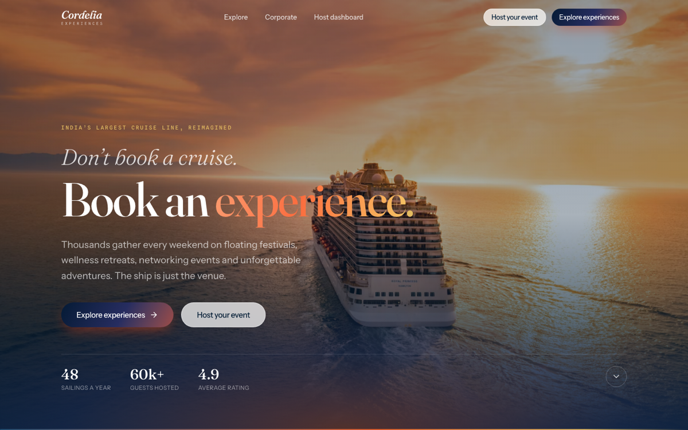
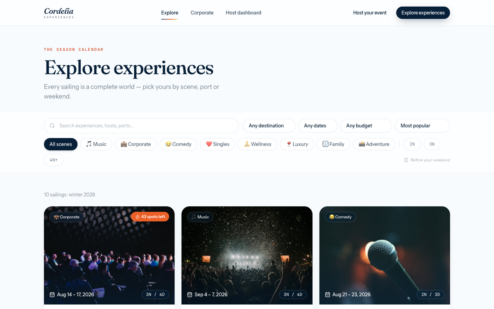
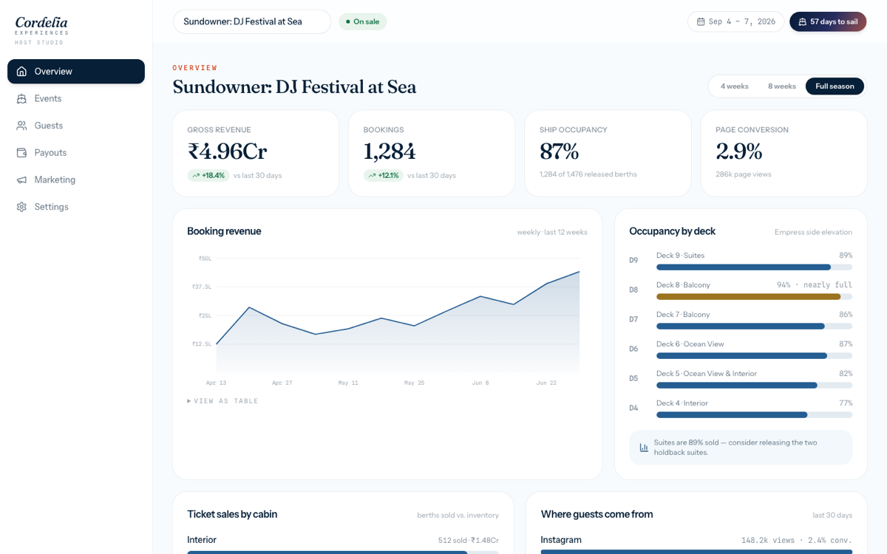
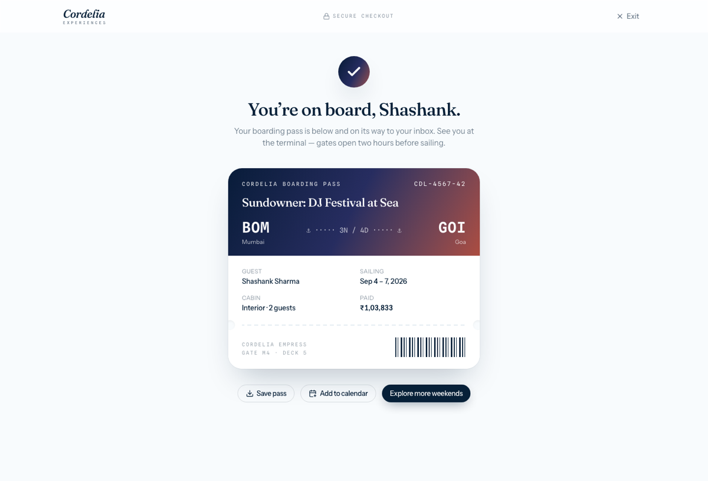

# Cordelia Experiences

**Don't book a cruise. Book an experience.**

A high-fidelity clickable prototype reimagining Cordelia — India's largest
cruise line — as an experience marketplace. Airbnb Experiences × Eventbrite,
where the ship is only the venue. Built investor-ready: real copy, real
booking math, real interactions.



| Explore marketplace | Host dashboard |
| --- | --- |
|  |  |

<p align="center">
  
</p>

## Run it

```bash
npm install
npm run dev        # → http://localhost:5173
```

```bash
npm test           # 25 unit tests (pricing, filtering, formatting)
npm run build      # type-check + production build
node scripts/screenshot.mjs   # visual sweep (uses local Playwright chromium)
```

## The surfaces

| Route | What it is |
| --- | --- |
| `/` | Homepage — sunset hero, 8 experience categories, featured bento, how-it-works, host CTA, testimonials |
| `/explore` | Marketplace grid — search, category/destination/budget/duration/date filters (URL-synced), skeleton states, designed empty state |
| `/experience/:slug` | Detail — immersive hero, itinerary timeline, cabins, FAQs, reviews, sticky **boarding-pass** booking card |
| `/book/:slug` | Booking flow — cabin → guests → add-ons → payment → animated boarding-pass confirmation, live fare quote |
| `/corporate` | Charter sales page — dark-luxury register, offerings, validated inquiry form |
| `/host` | Host dashboard — revenue chart, occupancy by deck, ticket sales, guest list, marketing assets |

Ten fully-written experiences (Startup Founders Cruise, Sundowner DJ Festival,
Women's Wellness Retreat, Comedy at Sea, Bollywood Nights…) with hosts,
schedules, cabins, add-ons, FAQs and reviews live in `src/lib/data.ts`.

## Design system

- **Palette** — deep ocean ink `oklch(24% 0.055 250)`, cool-white surface,
  sunset/coral/gold accents; the recurring **horizon rule** divider and
  sunrise gradient are the brand wash. Tokens in `src/styles/index.css` (`@theme`).
- **Type** — Fraunces (editorial display) · Instrument Sans (UI) ·
  Spline Sans Mono (boarding-pass vernacular: eyebrows, route codes, fares).
- **Signature** — the boarding pass: booking sidebar, checkout summary and
  confirmation all render as a perforated pass with route code and barcode.
- **Motion** — Motion (Framer) reveals and staggers; honors
  `prefers-reduced-motion` via `MotionConfig`.
- **Charts** — hand-rolled SVG; palette validated for CVD separation and
  contrast (`#255E92 / #E05A2B / #9C7420`), direct labels, table fallback.

## Stack

React 19 · TypeScript · Vite 6 · Tailwind CSS v4 · React Router 7 ·
Motion 12 · lucide-react · Vitest. Photography via Unsplash CDN with
gradient fallbacks (`Photo` component) so a failed image never breaks the frame.

## Prototype boundaries

No backend, auth or real payments — the payment step is decorative by design
and says so. Filters, booking math (GST, port charges, per-person add-ons),
and dashboards run on typed mock data.
